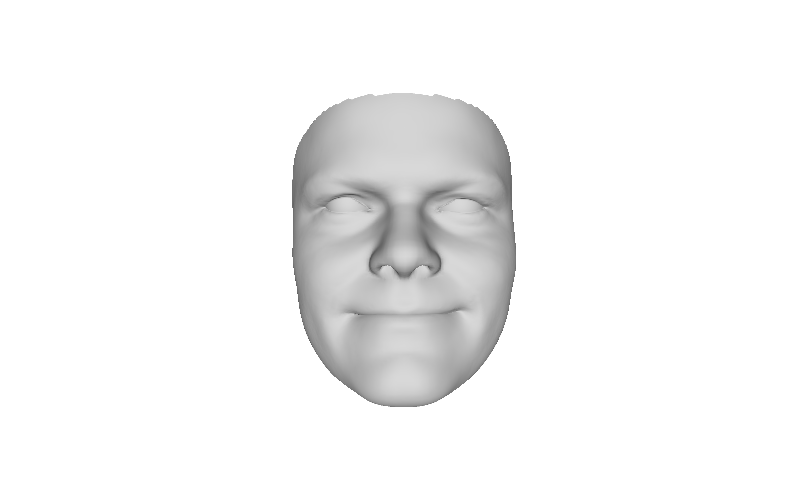
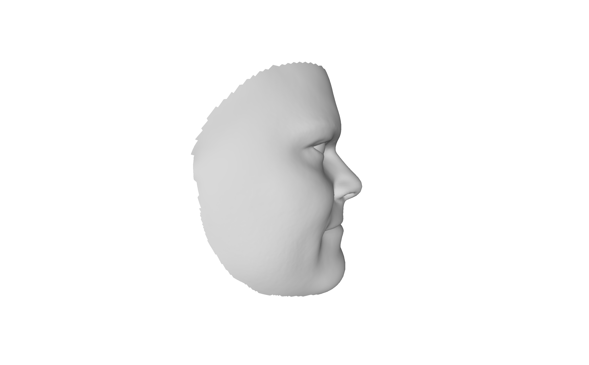
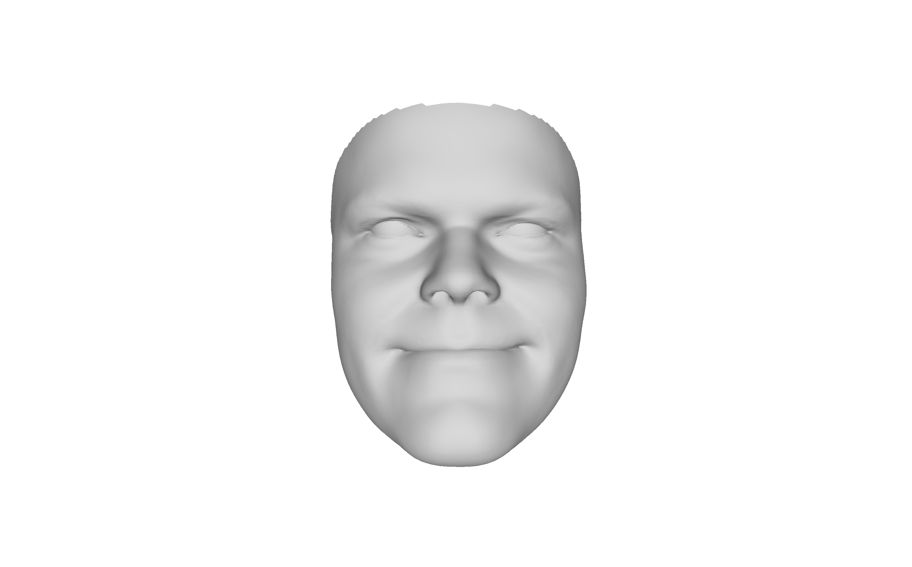
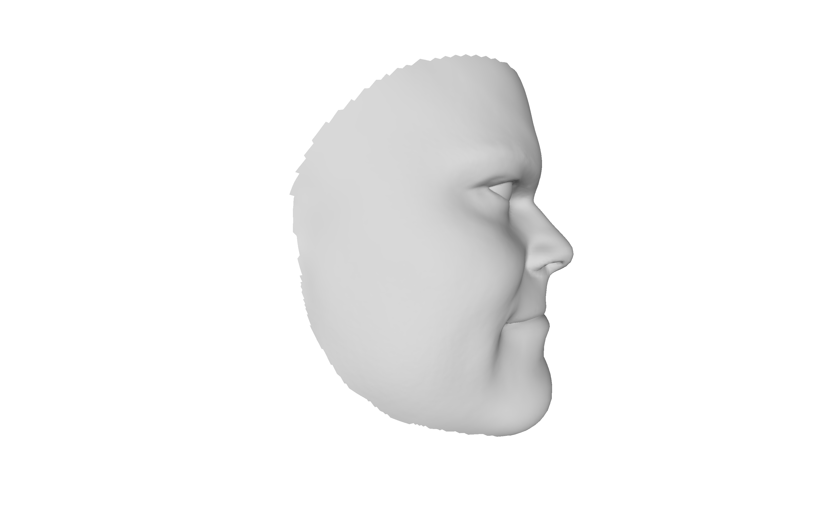
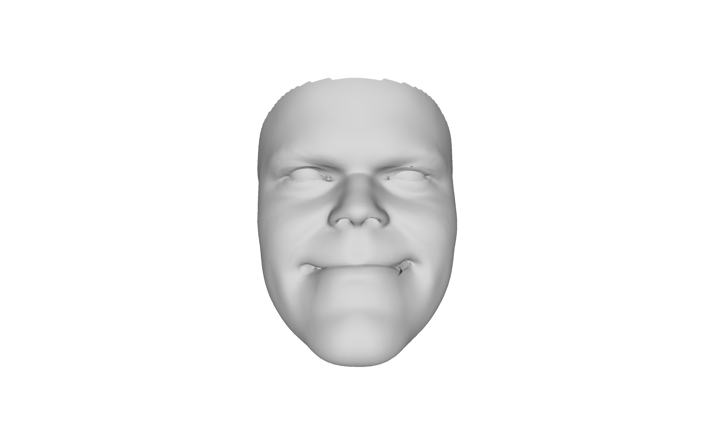
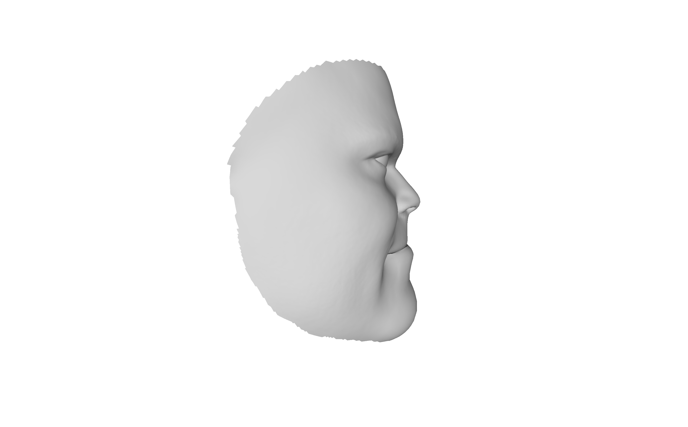

# Py-3D-Caricature 

📝 This repository contains the unofficial python implementation of the following paper:

> **[Computational Caricaturization of Surfaces](https://www.cs.technion.ac.il/wp-content/ron-kimmel/papers/Journal/SelaAflaloKimmel_CVIU2015.pdf)**<br>
> Matan Sela, Yonathan Aflalo, Ron Kimmel (CVIU 2015)

## Updates
🚀 **[2026/04/09]** Implement boundary conditions (Eq.30-31), area-weighted norm (Eq.30), and reference-free mode (Eq.20)
🚀 **[2026/04/08]** Fix minor bugs with AI assistance
🚀 **[2022/01/17]** Upload source code and example .obj files

## Requirements
✔️ Python >= 3.6  
✔️ [libigl python binding](https://libigl.github.io/libigl-python-bindings/)  
✔️ numpy  
✔️ scipy  
✔️ click  


## Usage

Check the basic usage:
```bash
python caricaturize.py --help
```

### Reference mode
When a reference (average) mesh is provided, the exaggeration is driven by the area ratio between the source and the reference mesh (Eq.18-19 in the paper).
`--beta` controls the exaggeration degree.
```bash
python caricaturize.py --outdir=./ --src=examples/src.obj --ref=examples/ref.obj --beta=0.6
```

### Reference-free mode
When no reference mesh is provided, a constant exaggeration factor `--gamma` is used (Eq.20 in the paper).
```bash
python caricaturize.py --outdir=./ --src=examples/src.obj --gamma=0.5
```

### Options
| Option | Description | Default |
|--------|-------------|---------|
| `--outdir` | Output directory (required) | - |
| `--src` | Source mesh .obj file (required) | - |
| `--ref` | Reference mesh .obj file (optional) | None |
| `--beta` | Exaggeration degree for reference mode | 0.1 |
| `--gamma` | Constant exaggeration factor for reference-free mode | 0.5 |
| `--meshplot` | Save .html visualization files | False |

## Results
<div align="center">
  
|Exaggeration degree|Output mesh (front)|Output mesh (profile)|
|:-:|:-:|:-:|
|0.0|||
|0.3|||
|0.6|||

</div>


## Contact
📫 You can have contact with [wonjong@postech.ac.kr](mailto:wonjong@postech.ac.kr) or [ycjung@postech.ac.kr](mailto:ycjung@postech.ac.kr)

## License
This software is being made available under the terms in the [LICENSE](LICENSE) file.

Any exemptions to these terms require a license from the Pohang University of Science and Technology.

**Notes:** The LICENSE only covers my code, not example meshes.

## Credits
❤️ This code is based on [the unofficial C++ implementation of the paper](https://github.com/posgraph/coupe.computational-caricaturization)
