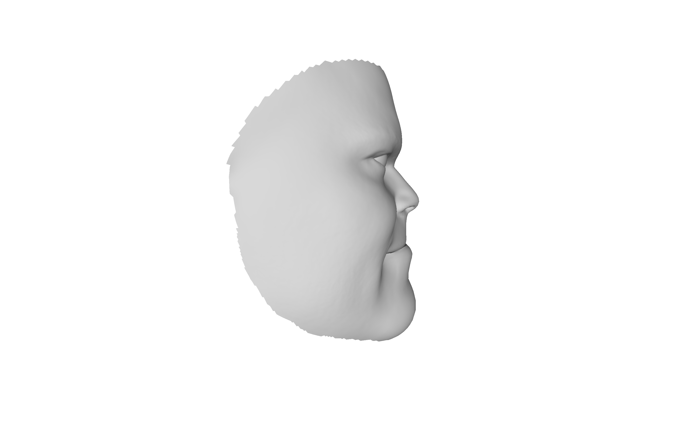

# Py-3D-Caricature


📝 This repository contains the unofficial python implementation of the following paper:

> **[Computational Caricaturization of Surfaces](https://www.cs.technion.ac.il/~ron/PAPERS/Journal/SelaAflaloKimmel_CVIU2015.pdf)**<br>
> Matan Sela, Yonathan Aflalo, Ron Kimmel, CVIU 2015

## Updates
🚀 **[2022/01/17]** Upload source code and example .obj files

## Requirements
✔️ Python >= 3.6  
✔️ [libigl python binding](https://libigl.github.io/libigl-python-bindings/)  
✔️ [PyMesh](https://pymesh.readthedocs.io/en/latest/installation.html) (Please download the source and build it instead of conda install)  
✔️ numpy  
✔️ scipy  
✔️ click  


## Usage

Check the basic usage:
```bash
python caricaturize.py --help
```
We provided some sample .obj files. Test on sample meshes:
```bash
python caricaturize.py --outdir=./ --ref=examples/ref.obj --src=examples/src.obj --beta=0.6
```

## Results
<div align="center">
  
|Exaggeration degree|Output mesh (front)|Output mesh (profile)|
|:-:|:-:|:-:|
|0.0|||
|0.3|||
|0.6|||

</div>


## Contact
📫 You can have contact with [wonjong@postech.ac.kr](mailto:wonjong@postech.ac.kr) or [ycjung@postech.ac.kr](mailto:ycjung@postech.ac.kr)

## License
This software is being made available under the terms in the [LICENSE](LICENSE) file.

Any exemptions to these terms require a license from the Pohang University of Science and Technology.

**Notes:** The LICENSE only covers my code, not example meshes.

## Credits
❤️ This code is based on [the unofficial C++ implementation of the paper](https://github.com/posgraph/coupe.computational-caricaturization)
